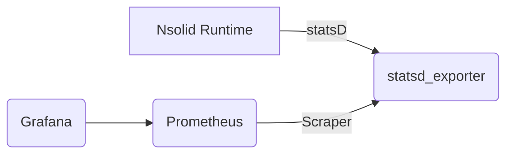

**Nsolid Runtime Metrics POC with Prometheus and Grafana**

This repository provides a Proof of Concept (POC) for sending metrics from an Nsolid runtime to Prometheus with StatsD via the `statsd_exporter` and visualizing them in Grafana.

**Prerequisites**

* Docker
* Docker Compose

**Getting Started**

1. Clone this repository.
> `git clone https://github.com/riosje/nsolid-prometheus-poc`
2. Run `docker-compose up`: This will build and run all necessary services, including Nsolid runtime, statsd_exporter, Prometheus, and Grafana.
3. Open Grafana in a web browser: [http://localhost:3000/dashboards](http://localhost:3000/dashboards)
4. Login to Grafana using the default username and password (`admin`/`admin`).
5. Browse the prebuilt dashboards

**Technical Overview**

* **Nsolid Runtime:** Sends metrics to the statsd_exporter using StatsD protocol.
* **statsd_exporter:** Receives and translates StatsD metrics into a Prometheus-compatible format.
* **Prometheus:** Scrapes metrics from the statsd_exporter and stores them in its database.
* **Grafana:** Connects to Prometheus and displays the collected metrics in customizable dashboards.



**Project Structure**

```
./
├── LICENSE
├── README.md
├── docker-compose.yml
├── grafana
    ├── dashboards
        ├── nsolid_dashboard.json
        └── nsolid_process.json
    └── provisioning
        ├── dashboards
            └── default.yaml
        └── datasources
            └── prometheus.yaml
├── nsolid
    ├── dockerfile
    ├── index.js
    └── package.json
└── prometheus
    └── prometheus.yml
```

**Customization**

* Modify the `nsolid` directory to configure your Nsolid application and metric emission.
* Customize the pre-configured Grafana dashboards to suit your specific needs.
* Refer to the provided documentation for more detailed information about each component and configuration options.

**Resources**

* **StatsD:** [https://github.com/statsd/statsd](https://github.com/statsd/statsd)
* **statsd_exporter:** [https://registry.hub.docker.com/r/prom/statsd-exporter](https://registry.hub.docker.com/r/prom/statsd-exporter)
* **Prometheus:** [https://prometheus.io/docs/prometheus/latest/configuration/configuration/#scrape_config](https://prometheus.io/docs/prometheus/latest/configuration/configuration/#scrape_config)
* **Grafana:** [https://grafana.com/docs/grafana/latest/](https://grafana.com/docs/grafana/latest/)

**License**

This project is licensed under the LICENSE: LICENSE file.

**Enjoy exploring the POC and customizing it for your Nsolid monitoring needs!**
